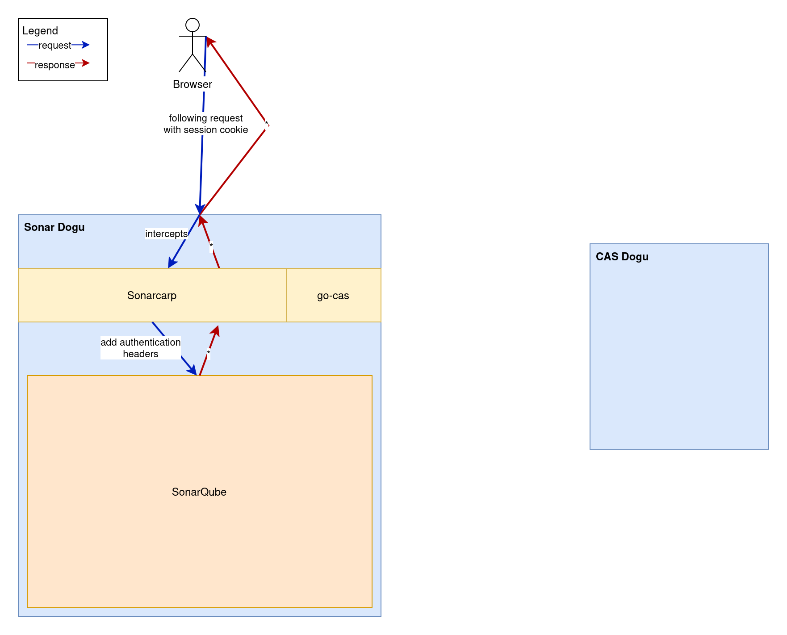
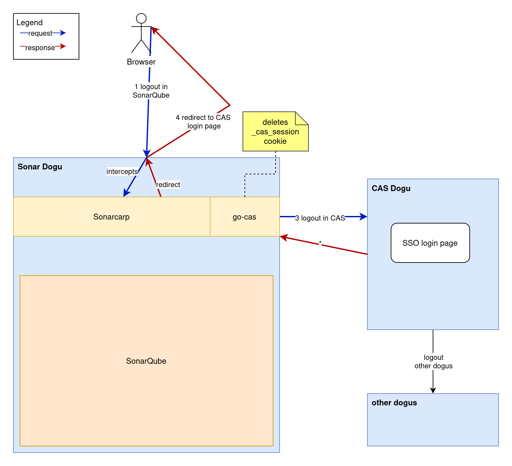

# Die Wirkweise von Sonarcarp verstehen

## Allgemeine Workflows im Sonarcarp

### Log-in

Mit SonarQube 2025 musste wegen einer mangelhaften Unterstützung das Sonar-CAS-Plugin durch einen CAS (Central Authentication Service) Authentication Reverse Proxy (CARP) abgelöst werden.

Beim Dogu-Start werden zunächst SonarQube-Startparameter in die CARP-Konfigurationsdatei gerendert. Sonarcarp führt mit diesem Befehl dann SonarQube aus, um mehrere Hauptprozesse im Container (und damit z. B. Container-Stopp-Probleme) zu vermeiden. 

Dieser Sonarcarp befindet sich am exponierte Port des SonarQube-Containers und fängt wie eine Machine-in-the-Middle alle
Requests ab und gleicht sie zuerst mit dem gestarteten SonarQube-Server ab. Dies geschieht, das SonarQube interne
Nutzerkonten (im Gegensatz zu externen Konten, also vom CAS/LDAP) zulässt, deren Abfrage im CAS dort im unnötig zu einem
Throttling führen könnte. Ist der Request noch nicht einem internen/externen Nutzerkonto authentifiziert, wird der 
Request von SonarQube mit HTTP401 abgelehnt. Ein eigener konfigurierbarer Throttling-Mechanismus in Sonarcarp sorgt für
eine zeitliche Verminderung der Angriffsoberfläche (wenn ein Schwellwert überschritten wird). Sonarcarp erkennt das 
HTTP401-Ergebnis und führt ein Redirect zum CAS-Login durch. Nach einer erfolgreichen Anmeldung wird zuerst ein 
CAS-Cookie ausgestellt. Dieser wird in einem erneuten Durchlauf (s. o.) aber erkannt und der Request wird zu SonarQube
hin kopiert und mit speziellen Authentifizierungsheadern `X-Forwarded-*` (s.u.) versehen, die SonarQube die externe Authentifizierung anzeigen.
SonarQubes Antwort wird dann auf den ursprünglichen Request (den nach dem CAS-Login) zurückgespiegelt.

Die folgenden Aspekte werden bei eingehenden Requests betrachtet:
- Welcher Client wird verwendet?
  - Browser: existiert ein Session-Cookie? 
    - wenn ja, verweist der Session-Cookie auf ein gültiges CAS-Service-Ticket?  
  - REST: existiert ein `Authorization`-Header?
- unterliegt ein Client gerade einem Throttling?

Die o. g. Authentifizierung gegenüber SonarQube findet durch Request-Anreicherung von `X-Forwarded-*`-Headern statt, da SonarQube diesbzgl. konfiguriert wird. Die bloße Anwesenheit dieser Headers zeigen SonarQube, dass der Zugriff zulässig sind. Deswegen ist es von höchster Dringlichkeit, dass SonarQube nur mittelbar durch den Sonarcarp zugänglich ist, da sonst beliebige Zugriffe mit diesen Headern ein Sicherheitsproblem darstellen.

Aktuell werden diese Header und Properties dafür verwendet:

| Eigenschaft   | Sonarcarp Header     | SonarQube Property          | Bemerkungen                                                 |
|---------------|----------------------|-----------------------------|-------------------------------------------------------------|
| Login         | `X-Forwarded-Login`  | sonar.web.sso.loginHeader   | Dies wird die ID innerhalb von SonarQube                    |
| Anzeigename   | `X-Forwarded-Name`   | sonar.web.sso.nameHeader    |                                                             |
| Email         | `X-Forwarded-Email`  | sonar.web.sso.emailHeader   |                                                             |
| Nutzergruppen | `X-Forwarded-Groups` | sonar.web.sso.groupsHeader  | User-Gruppen plus ggf. SonarQube-Admingruppe, kommagetrennt |

Die tatsächlich verwendeten Header-Werte entstammen dem CAS-Response. Gruppen werden durch Kommata getrennt. Es gibt eine spezielle, grundsätzlich fixe Gruppe `sonar-administrators`. Diese hat nach aktuellem Kenntnisstand keine konfigurierbare SonarQube-Property. Diese wird verwendet, wenn in der Menge der CAS-Gruppen ein die CES-Administratorgruppe entdeckt wird und dem entsprechenden Header hinzugefügt wird, damit CES-Administratoren auch SonarQube administrieren können.

Bezüglich Requestantworten von CAS oder SonarQube werden erwartungsgemäß HTTP-Status und Antwortinhalt mit in den Betrachtungskontext gesetzt (hierzu später mehr).

Die folgende Grafik visualisiert Beteiligte und deren allgemeine Kommunikation: 


Auf spezifische Kommunikationsfälle gehen die folgenden Abschnitte genauer ein.

#### CAS-Redirect und Session-Cookie

Dieser Abschnitt bezieht sich auf die Authentifizierungsmethode mit Session-Cookies in Webbrowsern.

CAS-Redirects wird im Browser-Szenario unterstützt. Dabei ermittelt go-cas anhand von Session-Cookies und CAS-Abfragen den Sitzungszustand. Existiert keine gültige SSO-Sitzung im CAS für das verwendete Konto, weist Sonarcarp die Abfrage mit einem Redirect auf die CAS-Seite um. An dieser Stelle kann sich eine Person mit den eigenen Zugangsdaten anmelden. CAS erzeugt bei Anmeldeerfolg im Browser einen `TGC`-Cookie an und leitet auf die ursprüngliche URL weiter.

Nach einem frischen Log-in existiert also lediglich ein TGC-Cookie auf dem `/cas`-Pfad. Um die Session zu überprüfen, prüft die verwendete `go-cas`-Bibliothek, ob ein CAS-Service-Ticket für das verwendete Anmeldekonto vorhanden ist. Spätestens jetzt sollte ein so ein Service-Ticket angelegt werden. Dadurch entsteht ein Cookie `_cas_session`, der das Anmeldekonto in allen folgenden Browserrequests der gleichen Session identifiziert. Bei erfolgreicher Antwort übermittelt `go-cas` auf Anfrage Nutzerattribute des verwendeten Anmeldekontos und speichert sich sowohl den Session-Bezeichner als auch das Service-Ticket ab. 


In nachfolgenden Requests wird dann bei erfolgreicher Prüfung der Session das Service-Ticket wiederverwendet.




#### Authorization-Header

Dieser Abschnitt bezieht sich auf die Authentifizierungsmethoden `Authorization: Basic {Username und Passwort Base64 enkodiert}` bzw. `Authorization: Bearer {SonarQube-Token}`. Während die oben beschriebene Anmeldeart mit Session-Cookies eine Browsersession identifiziert, beschreibt diese Anmeldeart Requests die ohne Browser und gegen die REST-Schnittstelle verwendet wird.

Dies beeinflusst die Art und Weise, welcher konkrete `go-cas`-Client verwendet wird. In der Regel werden nicht-/falsch-authentifizierte REST-Requests abgelehnt, anstatt mit dem Wert `HTTP 302 Found` auf die CAS-Anmeldeseite weiterzuleiten. Das liegt daran, dass REST-Clients das CAS-Login-Webformular nicht ausfüllen. 

#### Throttling

Der Aufbau durch untergeordnete Filter (s. u.) ermöglicht ein Throttling unabhängig davon, ob Request nun von Browsern oder REST-Clients gestellt wurden und diese durch SonarQube selbst oder durch den CAS beantwortet wurden. Dieses leistet der `ThrottlingHandler`, der eine [Token-Bucket](https://de.wikipedia.org/wiki/Token-Bucket-Algorithmus)-Implementierung verwendet.

Dieser überprüft anhand des HTTP-Response-Status, ob ein Wert `HTTP 401 Unauthorized` vorliegt. In diesem Fall zählt der ThrottlingHandler je Throttling-Client einen vorher festgelegten Token-Wert (siehe Wert `limiter-burst-size` in `carp.yaml.tpl`) herunter. Der Throttling-Client setzt sich aus Login und einer IP-Adresse zusammen, um falsch-positive Blockierungen zu vermeiden. 

| Throttling-Client-Anteil | Wert                             | Beispielwert                        | Fehlwert                         |
|--------------------------|----------------------------------|-------------------------------------|----------------------------------|
| Konto                    | Kontologin                       | your.cas.user@example.invalid       | sonarcarp.throttling@ces.invalid |
| IP-Adresse               | IP-Adresse vor nginx-Proxyierung | Inhalt von Header `X-Forwarded-For` | "" (bei Requests von Dogus)      |

Ab dem Augenblick, in dem kein Token mehr generieren lässt, sind für Requests für einen solchen Throttling-Client nicht mehr erlaubt. Alle folgenden Requests werden für den Throttling-Client frühzeitig mit `HTTP 429 Too many requests` quittiert und nicht weiter verarbeitet. Es muss so lange gewartet werden, bis sich über eine Zeit wieder Tokens angesammelt haben.

Sonarcarp ist stark auf die Header `X-Forwarded-*` gegenüber SonarQube zur Authentifizierung angewiesen ist, um eine Authentifizierung von Konten als "erfolgt" darzustellen. Diese Header sollten im Gegensatz zu den oben beschriebenen `Authorization`-Headern **niemals** im regulären Browserbetrieb auftreten. Daher sieht Sonarcarp es als Angriffsversuch auf die Authentifizierung an, wenn ein Client diese Header bereits verwendet. In diesem Falle werden sofort alle übrigen Tokens aufgebraucht, das zu den o. g. Folgen führt. Ein Logging dieses Ereignisses findet ebenfalls statt, um (je nach Sicherheitslösung) sofortige oder nachträgliche Meldung und Nachverfolgung zu ermöglichen.

### Log-out


#### Frontchannel Log-out

Es ist erwähnenswert, dass Logout-Calls keiner Session-Untersuchung unterliegen dürfen. D. h. es soll auch nicht-authentifizierten Anwender:innen möglich sein, die u. g. Logout-Endpunkte aufzurufen.

Um einen Frontchannel durchführen zu können, sind SonarQube-Session-Cookies nötig. Diese werden zur Laufzeit vorgehalten, um sie dann im Falle eines Backchannel-Log-outs verwenden zu können. Nach der Verwendung werden sie aus dem Speicher gelöscht. Frontchannel-Log-outs finden auf künstlichem Wege ebenfalls beim Backchannel-Log-out statt.

Frontchannel Log-out funktioniert aktuell wiefolgt:
1. Benutzer:in klickt auf den Logout-Navigationspunkt
2. Dies führt zu einem Request gegen den `/sonar/sessions/logout`-Endpunkt
3. Dies führt zu einem Request gegen den `/sonar/api/authentication/logout`-Endpunkt
4. Sonarcarp nimmt diesen Aufruf entgegen:
   - führt diesen Request zunächst NICHT gegen SonarQube aus
   - macht einen Redirect zum CAS-Logout, das einen Backchannel-Logout gegenüber allen registrierten Services (inkl. SonarQube) durchführt
   - der `_cas_session`-Cookie wird gelöscht
5. Es folgt ein Backchannel-Logout, den Sonarcarp entgegennimmt und den eigenen Zustand aufräumt (siehe unten).



#### Backchannel Log-out 

Backchannel Log-out funktioniert aktuell wiefolgt:

1. Benutzer:in loggt sich in einem anderen Service (oder durch Betätigung des Abmelden-Links im Warp-Menü) ab
2. Dies führt zu einem POST-Request von CAS gegen `/sonar/`
   - `Content-Type: application/x-www-form-urlencoded`
3. Sonarcarp nimmt diesen Aufruf entgegen:
   - erkennt diesen Vorgang und löscht Sessioninformationen aus den Memory-Maps im `go-cas`-Anteil von Sonarcarp
   - Sonarcarp hat keine Verbindung zum Browser, da der Request vom CAS kommt, daher werden auch keine Cookies gelöscht

 
#### SonarQube-Tokens

SonarQube stellt eigene Cookies aus, wenn eine erfolgreiche Anmeldung erkannt wurde. Dies sind `JWT-SESSION` und `XSRF-TOKEN`. Diese haben eine vordefinierte Gültigkeitsdauer, die durch den Konfigurationswert `sonar.web.sessionTimeoutInMinutes` in `dogu.json` verändert werden können. Die genannten Cookies können über Logout-Aktionen hinweg bestehen bleiben. Dies ist akzeptiertes Verhalten, da Sonarcarp sich um das eigentliche Sitzungsverhalten kümmert.

## Filter

Prozesse rund um das Thema Authentifizierung ist häufig komplex. Um die Verarbeitung unterschiedlicher Aspekte zu 
trennen und zu vereinfachen, wurden ähnliche Vorgehensverfahren in unterschiedliche Filter ausgelagert. Ein Filter soll
so möglichst sich immer nur um die Abwicklung eines Teils kümmern.

Diese Filter werden ineinander gesteckt, sodass eine Filterkette entsteht. Requests müssen für die erfolgreiche 
Verarbeitung alle diese Filter nacheinander passieren (für die Verkettung ist der carp-Serverteil verantwortlich, in umgekehrter Reihenfolge). Allerdings kann jederzeit aus der Filterkette ausgestiegen werden. Bei Fehlerzuständen, die Sonarcarp oder CAS zu verantworten haben, wird dann ein Wert `HTTP 500 Internal server error` zurückgeliefert. Bei Fehlern, die der Client zu verantworten hat, können die Antworten auch aus der HTTP-4xx-Range stammen. Dies können z. B. fehlende Daten oder wiederholte Falschanmeldungen sein:

```
HTTP-Client (Browser oder REST)
⬇️     ⬆️
logHandler (loggt ggf.)
⬇️     ⬆️
throttlingHandler (erkennt HTTP 401 und behandelt Client-Requests durch Throttling) 
⬇️     ⬆️
casHandler (unterscheidet Rest- von Browser-Requests, prüft Anfragen ggü. CAS)
⬇️     ⬆️
proxyHandler (bewältigt übrige Authentifizierungsteile und Umsetzung des Request-/Response-Proxyings)
⬇️     ⬆️
SonarQube
```

In jeder Filterstufe ist potenziell eine Unterbrechung der Kette (i. d. R. durch Abweisung des Requests) möglich.