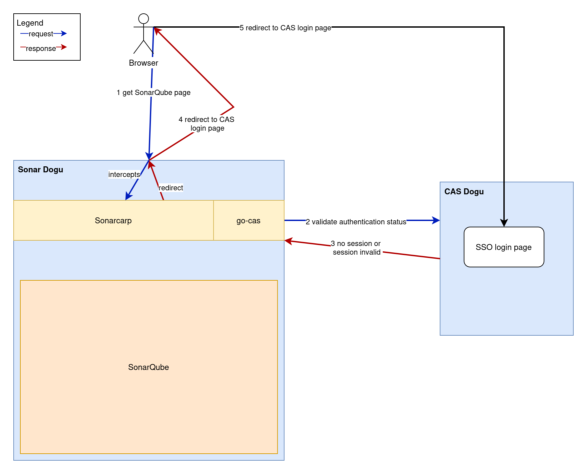
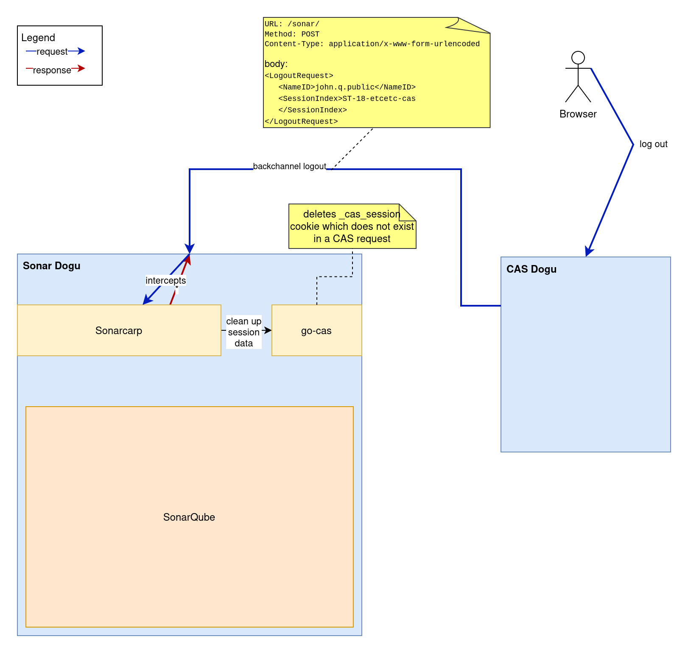

# Understanding how Sonarcarp works

## General workflows in Sonarcarp

### Log in

With SonarQube 2025, the Sonar CAS plugin had to be replaced by a CAS (Central Authentication Service) Authentication
Reverse Proxy (CARP) due to inadequate support on the SonarQube side.

When the Dogu starts, SonarQube startup parameters are first rendered into the CARP configuration file. Sonarcarp then executes SonarQube with this command to avoid multiple main processes in the container (and thus, for example, container stop problems).

This Sonarcarp is located at the exposed port of the SonarQube container and, like a machine-in-the-middle, intercepts all requests and first compares them with the started SonarQube server. This is done because SonarQube allows internal user accounts (as opposed to external accounts, i.e., from CAS/LDAP), whose query in CAS could unnecessarily lead to throttling. If the request has not yet been authenticated to an internal/external user account, the request is rejected by SonarQube with HTTP401. Sonarcarp's own configurable throttling mechanism ensures a temporary reduction in the attack surface (if a threshold value is exceeded). Sonarcarp recognizes the
HTTP401 result and redirects to the CAS login. After successful login, a CAS cookie is first issued. However, this is recognized in a new run (see above) and the request is copied to SonarQube and provided with special authentication headers `X-Forwarded-*` (see below), which allow SonarQube to perform external authentication.

The following aspects are considered for incoming requests:
- Which client is being used?
  - Browser: Does a session cookie exist?
    - If so, does the session cookie refer to a valid CAS service ticket?
  - REST: Does an `Authorization` header exist?
- Is a client currently subject to throttling?

The above-mentioned authentication with SonarQube takes place through request enrichment of `X-Forwarded-*` headers, as SonarQube is configured for this purpose. The mere presence of these headers indicates to SonarQube that access is permitted. It is therefore of utmost importance that SonarQube is only accessible indirectly through Sonarcarp, as otherwise any access with these headers poses a security risk.

Currently, these headers and properties are used for this purpose:

| Property    | Sonarcarp Header     | SonarQube Property         | Comments                                                                    |
|-------------|----------------------|----------------------------|-----------------------------------------------------------------------------|
| Login       | `X-Forwarded-Login`  | sonar.web.sso.loginHeader  |                                                                             |
| Anzeigename | `X-Forwarded-Name`   | sonar.web.sso.nameHeader   |                                                                             |
| Email       | `X-Forwarded-Email`  | sonar.web.sso.emailHeader  |                                                                             |
| User groups | `X-Forwarded-Groups` | sonar.web.sso.groupsHeader | User groups plus SonarQube admin group (if applicable), separated by commas |

The header values actually used come from the CAS response. Groups are separated by commas. There is a special, fundamentally fixed group called `sonar-administrators`. As of now, this group does not have any configurable SonarQube properties. It is used when the CES administrator group is detected in the set of CAS groups and added to the corresponding header so that CES administrators can also administer SonarQube.

As expected, HTTP status and response content are included in the context of consideration for request responses from CAS or SonarQube (more on this later).

The following graphic visualizes the participants and their general communication:.The following sections discuss specific communication cases in more detail.

#### CAS Redirect and Session cookie

This section refers to the authentication method using session cookies in web browsers.

CAS redirects are supported in the browser scenario. Go-cas determines the session status based on session cookies and CAS queries. If there is no valid SSO session in CAS for the account used, Sonarcarp redirects the query to the CAS page. At this point, a person can log in with their own access data. If the login is successful, CAS generates a `TGC` cookie in the browser and redirects to the original URL.

After a fresh login, only a TGC cookie exists on the `/cas` path. To verify the session, the `go-cas` library used checks whether a CAS service ticket exists for the login account used. At this point at the latest, such a service ticket should be created. This creates a `_cas_session` cookie that identifies the login account in all subsequent browser requests for the same session. If the response is successful, `go-cas` transmits the user attributes of the login account used upon request and stores both the session identifier and the service ticket. In subsequent requests, the service ticket is then reused if the session is successfully verified.

CAS redirects are supported in the browser scenario. go-cas determines the session status based on session cookies and CAS queries. If there is no valid SSO session in CAS for the used



#### Authorization header

This section refers to the authentication methods `Authorization: Basic {username and password encoded in Base64}` and `Authorization: Bearer {SonarQube token}`. While the login type described above uses session cookies to identify a browser session, this login type describes requests that are used without a browser and against the REST interface.

This affects the type of `go-cas` client used. As a rule, unauthenticated/incorrectly authenticated REST requests are rejected instead of being redirected to the CAS login page with the value `HTTP 302 Found`. This is because REST clients do not fill out the CAS login web form.

#### Throttling

The structure of subordinate filters (see below) enables throttling regardless of whether requests were made by browsers or REST clients and whether they were answered by SonarQube itself or by CAS. This is achieved by the `ThrottlingHandler`, which uses a [token bucket](https://de.wikipedia.org/wiki/Token-Bucket-Algorithmus) implementation.

This checks the HTTP response status to see if there is an HTTP 401 Unauthorized value. If so, the throttling handler counts down a predefined token value (see limiter-burst-size value in carp.yaml.tpl) for each throttling client. The throttling client consists of a login and an IP address to avoid false positive blocks.

| Throttling client part | Value                            | Example value                       | Missing value                    |
|------------------------|----------------------------------|-------------------------------------|----------------------------------|
| Account                | Account login                    | your.cas.user@example.invalid       | sonarcarp.throttling@ces.invalid |
| IP address             | IP address before nginx proxying | Content of header `X-Forwarded-For` | "" (for requests from Dogus)     |

From the moment that no more tokens can be generated, requests for such a throttling client are no longer permitted. All subsequent requests are acknowledged early with `HTTP 429 Too many requests` for the throttling client and are not processed further. It is necessary to wait until tokens have accumulated again over time.

Sonarcarp relies heavily on the `X-Forwarded-*` headers from SonarQube for authentication in order to display accounts as "authenticated". Unlike the `Authorization` headers described above, these headers should **never** appear in regular browser operation. Therefore, Sonarcarp considers it an authentication attack if a client already uses these headers. In this case, all remaining tokens are immediately used up, leading to the consequences mentioned above. This event is also logged to enable immediate or subsequent reporting and tracking (depending on the security solution).

### Log-out

#### Frontchannel logout

It is worth noting that logout calls must not be subject to session inspection. This means that even unauthenticated users should be able to call the logout endpoints listed below.

SonarQube session cookies are required to perform a front channel. These are stored at runtime so that they can be used in the event of a back channel logout. After use, they are deleted from memory. Front channel logouts also take place artificially during back channel logouts.

Front channel logout currently works as follows:

1. The user clicks on the logout navigation item
2. This leads to a request to the `/sonar/sessions/logout` endpoint
3. This leads to a request to the `/sonar/api/authentication/logout` endpoint
4. Sonarcarp receives this call:
   - Initially does NOT execute this request against SonarQube
   - Redirects to the CAS logout, which performs a backchannel logout for all registered services (including SonarQube).
5. This is followed by a backchannel logout, which Sonarcarp receives and cleans up its own state (see below)

#### Backchannel Log-out 

1. User logs out of another service (or by clicking the logout link in the Warp menu)
2. This results in a POST request from CAS to `/sonar/`
   - `Content-Type: application/x-www-form-urlencoded`
3. Sonarcarp receives this call:
   - recognizes this process and deletes session information from the memory maps in the `go-cas` part of Sonarcarp
   - Sonarcarp has no connection to the browser because the request comes from CAS, so no cookies are deleted


#### SonarQube tokens

SonarQube issues its own cookies when a successful login is detected. These are `JWT-SESSION` and `XSRF-TOKEN`. These have a predefined validity period, which can be changed by the configuration value `sonar.web.sessionTimeoutInMinutes` in `dogu.json`. The cookies mentioned above can remain active even after logout actions. This is accepted behavior, as Sonarcarp takes care of the actual session behavior.

## Filters

Processes related to authentication are often complex. In order to separate and simplify the processing of different 
aspects, similar procedures have been outsourced to different filters. A filter should ideally only handle one part of 
the process.

These filters are inserted into each other to form a filter chain. Requests must pass through all of these filters in sequence for successful processing
(the carp server part is responsible for the chaining, in reverse order). However, it is possible to exit the filter chain at any time. In the event of errors caused by Sonarcarp or CAS, a value `HTTP 500 Internal server error` is returned. In the event of errors caused by the client, the responses may also come from the HTTP 4xx range. These can be, for example, missing data or repeated incorrect logins:

```
Client (Browser oder REST)
⬇️     ⬆️
logHandler (logs if necessary)
⬇️     ⬆️
throttlingHandler (detects HTTP401 and handles client requests through throttling) 
⬇️     ⬆️
casHandler (distinguishes between REST and browser requests, checks requests against CAS)
⬇️     ⬆️
proxyHandler (handles remaining authentication parts and implementation of request/response proxying)
⬇️     ⬆️
SonarQube
```

At each filter stage, there is the potential for an interruption in the chain (usually due to rejection of the request).
