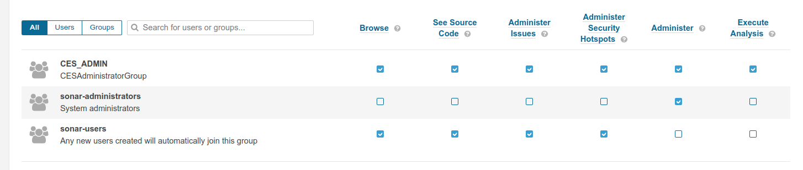

# Permission template

The permission template is a mechanism in SonarQube to set up *project permissions*. The default template will be changed
during the dogu startup to ensure that the CES_ADMIN group has access to administer new created projects. The following
permissions will be set (admin codeviewer issueadmin securityhotspotadmin scan user ) this setup can be verified
(`Administration -> Security -> Permisssion Templates`). *see setup.json for further details*

# Correction of incorrectly configured projects

New projects that were created with the default template to which the admin group was not linked can be corrected retrospectively.

To do this, the following steps must be carried out:
1. Set configuration key `amend_projects_with_ces_admin_permissions`:
   A timestamp in the format `YYYY-MM-DD hh:mm:ss` (e.g. `2025-03-20 09:30:00`) must be entered here.
   The Dogu saves the timestamp of the last execution internally and compares this timestamp with the timestamp from the configuration.
   If the timestamp entered in the configuration is “newer”, the projects are corrected when the dogu is restarted.
   > Note:** If a timestamp with a date in the future is entered, the projects are corrected each time the Dogus is started until the entered time is reached.

2. restart the Dogu`
   This ensures that the admin group is added to all projects with the necessary authorizations.

*see description `configuration` in the file `dogu.json` for more information*

The group is added using the API endpoint `permissions/add_group`.
